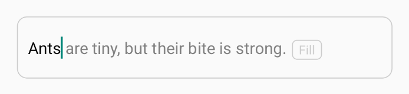

# SuggestionInput

A customizable React Native text input component that suggests and auto-fills text from a given suggestion string. It supports **drag-to-fill**, **tap-to-fill**, and **auto-suggestion** with various customization options like colors, styles, and fill modes.

---

---

## ✨ Features

- 🔍 Real-time suggestion and auto-fill as user types.
- 🔁 Two fill modes: **textPress** (tap) and **textDrag** (drag).
- 🎨 Fully customizable styles and colors.
- ⚖️ Configurable case-sensitivity.
- 🧹 Easily integrable in any form or input field.

---

## 📦 Installation

```bash
npm install react-native-suggestion-input
# or
yarn add react-native-suggestion-input
```

---

## 🧹 Usage Example

```tsx
import React, { useState } from 'react';
import { View } from 'react-native';
import SuggestionInput from 'react-native-suggestion-input';

const App = () => {
  const [text, setText] = useState('');

  return (
    <View style={{ padding: 20 }}>
      <SuggestionInput
        value={text}
        onChangeText={setText}
        suggestion="Ants are tiny but their bite is strong"
        inputTextColor="black"
        suggestionTextColor="gray"
        placeholder="Type here..."
        textStyle={{ fontSize: 16, fontWeight: '500' }}
        fillType="textDrag"
        caseSensitive={false}
        containerStyle={{ borderColor: '#aaa', borderWidth: 1 }}
        showFillButton={true}
        maxLength={50}
      />
    </View>
  );
};

export default App;
```

---

## ⚙️ Props

| Prop                  | Type                        | Default        | Description                                                               |
| --------------------- | --------------------------- | -------------- | ------------------------------------------------------------------------- |
| `value`               | `string`                    | —              | The current value of the input field.                                     |
| `onChangeText`        | `(text: string) => void`    | —              | Callback when text changes.                                               |
| `suggestion`          | `string`                    | —              | Suggestion text to match and fill.                                        |
| `inputTextColor`      | `string`                    | `'black'`      | Color of the user-entered text.                                           |
| `suggestionTextColor` | `string`                    | `'gray'`       | Color of the suggestion text.                                             |
| `placeholder`         | `string`                    | `'Type here…'` | Placeholder for the input.                                                |
| `textStyle`           | `TextStyle`                 | —              | Style for the text input and suggestion.                                  |
| `fillType`            | `'textPress' \| 'textDrag'` | `'textPress'`  | Fill mode: tap or drag to fill.                                           |
| `caseSensitive`       | `boolean`                   | `false`        | If true, matches suggestion case-sensitively.                             |
| `containerStyle`      | `ViewStyle`                 | —              | Style for the outer container.                                            |
| `showFillButton`      | `boolean`                   | `false`        | Show a "Fill" button next to suggestion text.                             |
| `...TextInputProps`   | `TextInputProps`            | —              | All other native `TextInput` props like `maxLength`, `keyboardType`, etc. |

---

## 🧠 Benefits

- Improves **data entry speed** and **accuracy**.
- Mimics Gmail-style **tab-to-complete** experience.
- Enhances **user experience** with visual feedback and suggestion clarity.
- Allows full control over **fill behavior**, **style**, and **interaction** mode.

---

## 🧑‍💻 Author

**Made with ❤️ by Antos Maman**

- GitHub: [@antosmamanktr](https://github.com/antosmamanktr)
- Email: [antosmamanktr@gmail.com](mailto\:antosmamanktr@gmail.com)

---

## 📄 License

MIT License

